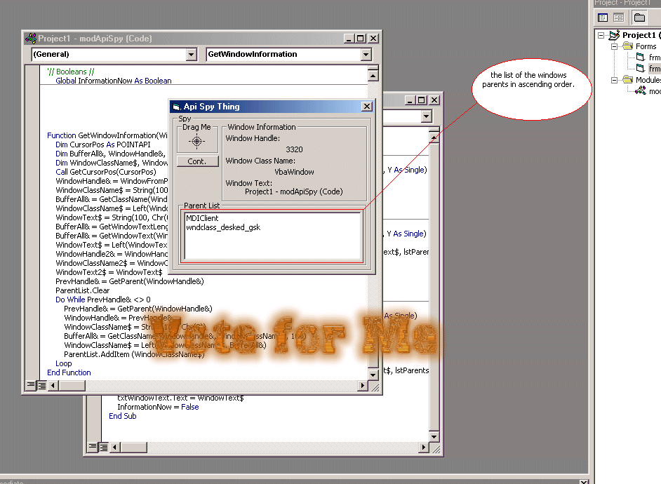



## API Spy Example

### Description

Get a windows handle, class name, and text. as well as add all of its parents in ascending order to a listbox.
 
### More Info
 

             |
---                |---
**Submitted On**   |2002-07-29 02:47:46
**By**             |[Robert Cleaver](https://github.com/Planet-Source-Code/PSCIndex/blob/master/ByAuthor/robert-cleaver.md)
**Level**          |Intermediate
**User Rating**    |5.0 (25 globes from 5 users)
**Compatibility**  |VB 6\.0
**Category**       |[Windows API Call/ Explanation](https://github.com/Planet-Source-Code/PSCIndex/blob/master/ByCategory/windows-api-call-explanation__1-39.md)
**World**          |[Visual Basic](https://github.com/Planet-Source-Code/PSCIndex/blob/master/ByWorld/visual-basic.md)
**Archive File**   |[API\_Spy\_Ex1119127292002\.zip](https://github.com/Planet-Source-Code/robert-cleaver-api-spy-example__1-37351/archive/master.zip)

